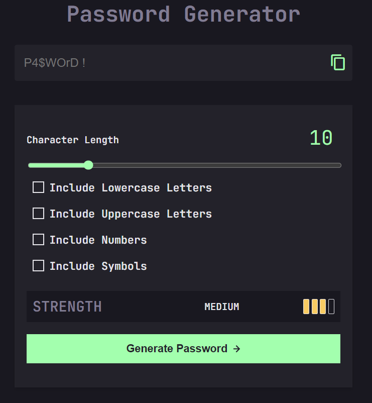

# Password Generator

I developed this app to create random passwords and evaluate their strength, indicating whether they are weak, medium, or strong.

## Features

- **Random Password Generation**: I implemented functionality to generate passwords based on user preferences, including length and character types (lowercase letters, uppercase letters, numbers, and symbols).
- **Password Strength Indicator**: I included a feature to evaluate and display the strength of the generated password, categorizing it as weak, medium, or strong.
- **Copy to Clipboard**: I added a convenient button to copy the generated password to the clipboard.
- **Responsive Design**: I ensured the app adapts well to different screen sizes and devices.
- **Interactive Elements**: I focused on providing a user-friendly experience with intuitive controls and real-time feedback.
- **Modern JavaScript (ES6+)**: I utilized modern JavaScript features for cleaner, more efficient code.

## Screenshots

### 1. Large Screens

### 2. Small Screens

## Learning Objectives

While developing this project, I focused on the following learning objectives:

- **Modern JavaScript (ES6+)**: I aimed to understand and apply key ES6+ features.
- **Arrow Functions**: I used concise function expressions with lexical `this` behavior.
- **Template Literals**: I created dynamic strings and embedded expressions.
- **Destructuring Assignment**: I extracted values from arrays and objects for cleaner code.
- **Classes**: I implemented the password generator logic using ES6 classes for better organization.
- **Let and Const**: I understood the difference between `let` and `const` for variable declaration and scoping.
- **Default Parameters**: I provided fallback values for function arguments.
- **Spread Syntax and Rest Parameters**: I worked efficiently with arrays and function arguments.

## Project Setup

1. **Get the Project Files**: Download the project files from the link provided by the trainer.
2. **Familiarize with the UI**: Review the provided HTML, CSS, and design assets to understand the layout and desired functionality.

## Tasks

### HTML Structure

I created the necessary HTML elements for:

- A slider for password length.
- Checkboxes for character types.
- A button to generate the password.
- A button to copy the password.
- A strength indicator.

### CSS Styling

I styled the elements according to the provided design and ensured the layout is responsive and works well on different screen sizes. I also considered using a CSS preprocessor (like Sass or Less) for easier style organization.

### JavaScript Functionality

I wrote functions to:

- Generate a random character based on selected criteria.
- Generate a password based on user input.
- Update the password display area with the generated password.
- Calculate the strength of the password.
- Copy the generated password to the clipboard.

I used ES6 classes to structure my JavaScript code and leveraged `let` and `const` for variable declarations. I applied default parameters for flexibility in function arguments and utilized spread syntax and rest parameters to streamline array and function argument handling.

### Event Handling

I added event listeners to handle user interactions with the interface.

### Testing and Refinement

I thoroughly tested the functionality to ensure it works as expected and refined the design and functionality based on my ideas and feedback.

## Evaluation Criteria

1. **ES6 Proficiency**:
   - I made effective use of arrow functions, template literals, destructuring assignment, classes, `let` and `const`, default parameters, and spread/rest syntax.
2. **Functionality**:
   - I ensured correct generation of passwords based on user input and proper implementation of length selection, character type selection, copy button, and strength calculator.
3. **Design**:
   - I aimed for a clean, user-friendly interface that aligns with the design requirements and is visually appealing and easy to understand.
4. **Responsiveness**:
   - I ensured adaptability to different screen sizes and devices for a consistent user experience across various viewports.
5. **Code Quality**:
   - I wrote well-structured, readable, and maintainable code with clear and descriptive variable and function names.

## Getting Started

1. Clone the repository or download the project files.
2. Open the `index.html` file in your preferred web browser to see the initial UI.
3. Start implementing the features and functionality as outlined in the tasks.

## Contribution

Feel free to contribute by creating pull requests or opening issues for any bugs or improvements.

## License

This project is licensed under the MIT License.

---
